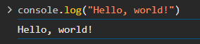
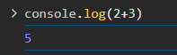
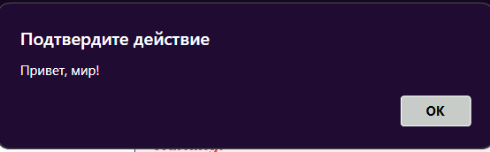
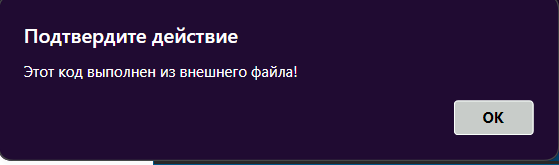
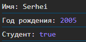
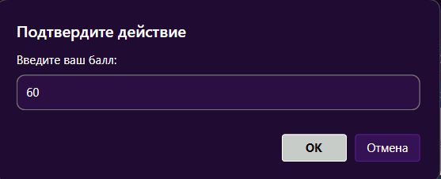
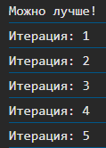

# Лабораторная работа №1: Введение в JavaScript

## Цель
Познакомиться с основами JavaScript, научиться писать и выполнять код в браузере и в локальной среде, разобраться с базовыми конструкциями языка.

## Структура проекта
- `index.html` – основная HTML-страница, содержащая подключение внешнего JavaScript-файла.
- `script.js` – внешний файл JavaScript, содержащий код лабораторной работы.
- `screenshots` - папка с скриншотами по проделанной работе.

## Выполнение кода JavaScript в браузере
1. Открыл файл `index.html` в браузере.
2. Написал команду console.log("Hello, world!");
    
3. Запиcал в консоль 2 + 3.
    
4. Создал первую HTML-страницы и подключил к нему JavaScript
Код в `index.html`:
```HTML
<!DOCTYPE html>
<html lang="en">
 <head>
   <title>Привет, мир!</title>
   <script src="script.js"></script>
</head>
 <body>
   <script>
     alert("Привет, мир!");
     console.log("Hello, console!");
   </script>
 </body>
</html>
```



5. Добавил код в script.js:

```javascript
alert("Этот код выполнен из внешнего файла!");
console.log("Сообщение в консоли");
```



## Работа с типами данных

1. В файле script.js создал несколько переменных.
Пример кода в `script.js`:
```javascript
let name = "Serhei";
let birthYear = 2005;
let isStudent = true;

console.log("Имя:", name);
console.log("Год рождения:", birthYear);
console.log("Студент:", isStudent);
```


2. Проверил как работают условия и циклы 
Пример кода в `script.js`:
```javascript
let score = prompt("Введите ваш балл:");
if (score >= 90) {
    console.log("Отлично!");
} else if (score >= 70) {
    console.log("Хорошо");
} else {
    console.log("Можно лучше!");
}

for (let i = 1; i <= 5; i++) {
    console.log(`Итерация: ${i}`);
}
```



## Контрольные вопросы
1. Чем отличаются `var`, `let` и `const`?

var — устаревший способ объявления переменных, его можно переопределять, а область видимости охватывает всю функцию. let имеет блочную область видимости (доступен только внутри {}) и не позволяет повторно объявлять переменную. const похож на let, но не позволяет изменять значение переменной после присваивания. Лучше использовать let и const, а var избегать.

2. Что такое неявное преобразование типов в JavaScript?

Неявное преобразование типов — это когда JavaScript автоматически меняет тип данных переменной. Например, "5" + 2 даст "52", так как число 2 превращается в строку. А "10" - 5 даст 5, потому что строка "10" преобразуется в число. Иногда это удобно, но может приводить к неожиданным результатам, поэтому лучше явно указывать типы.

3. Как работает оператор `==` в сравнении с `===`?

== сравнивает значения, но может преобразовывать типы, например, 5 == "5" вернет true. === сравнивает и значения, и их типы, поэтому 5 === "5" вернет false. Лучше использовать ===, чтобы избежать неожиданных ошибок из-за преобразования типов.

## Заключение
В ходе выполнения данной лабораторной работы я познакомился с основами JavaScript, научился выполнять код как в браузере через консоль разработчика, так и с помощью HTML-страницы. Я освоил подключение внешнего JavaScript-файла и использование встроенного <script> в HTML.

- Основные типы данных в JavaScript (строки, числа, логические значения).
- Объявление переменных с let, const и var и их различия.
- Управление потоком выполнения с помощью условных операторов (if-else).
- Использование циклов (for) для повторяющихся операций.

Практическое выполнение заданий помогло закрепить знания о синтаксисе языка и его основных конструкциях. Теперь я понимаю, как динамически управлять содержимым веб-страницы с помощью JavaScript.
