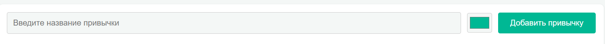
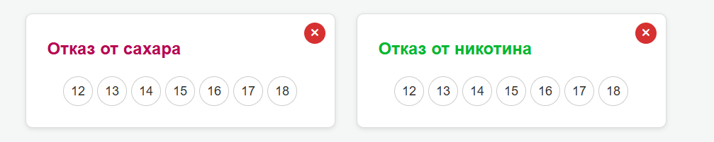
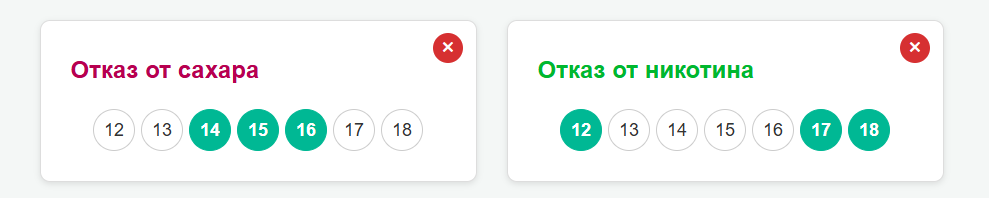
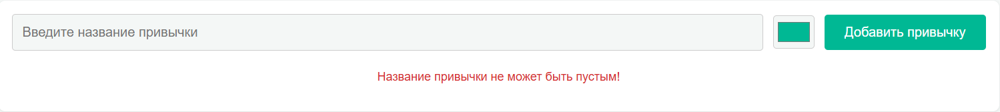

# Индивидуальная работа: Трекер привычек (Habit Tracker)

## Описание проекта

**Трекер привычек** — это веб-приложение, позволяющее пользователю эффективно отслеживать выполнение своих привычек. Цель проекта — создать визуальный и удобный инструмент, мотивирующий пользователя выполнять полезные действия регулярно.

**Основные функции:**
- Добавление новых привычек с выбором цвета.
- Ведение ежедневной статистики за последние 7 дней.
- Возможность отметить выполнение привычки за определённый день.
- Поиск привычек по названию.
- Фильтрация по статусу: выполненные / невыполненные / все.
- Поддержка светлой и тёмной темы интерфейса.
- Данные сохраняются в `localStorage`, не требуя подключения к серверу.

---

## ⚙️ Установка и запуск

### 📁 Структура проекта

```
habitTracker/
├── index.html        
├── style.css         
└── src/              
    ├── habitManager.js - Логика управления данными привычек
    └── main.js -  Основная логика интерфейса и взаимодействия        
```

### Запуск приложения

1. Клонируйте репозиторий или скачайте ZIP:
   ```bash
   git clone https://github.com/your-username/habit-tracker.git
   ```
2. Открыть через Live Server в VS Code


## Примеры использования

1. Добавление новой привычки



У нас есть форма ввода названия привычки, выбора цвета и кнопка добавления. Также вот пример кода

```javascript
    addHabit(name, color) {
        const habits = this.getHabits();
        const newHabit = {
            id: Date.now().toString(),
            name: name.trim(),
            color: color || '#00b894',
            dates: {},
        };
        habits.push(newHabit);
        this.saveHabits(habits);
        return newHabit;
    },
```

2. Отоброжение привычки




Как выглядит выделение выполненных дней.



Скриншот с сообщением ошибки при попытке добавить привычку без названия.



## Технологии

* HTML
* CSS
* JavaScript (ES Modules)
* Local Storage API

## Источники и вдохновение

* W3Schools – https://www.w3schools.com/
* JS курс на Moodle -  https://moodle.usm.md/course/view.php?id=6455
* Идеи и визуальные решения из приложений Habitica, Loop Habit Tracker

## Дополнительная информация
* Поддерживается адаптивная верстка — интерфейс корректно отображается на экранах от 320px шириной.
* Приложение не требует регистрации и работает в оффлайн-режиме.
* Все данные сохраняются только на стороне пользователя в localStorage. Если очистить кэш браузера — данные исчезнут.


# Автор проекта

- ФИО: [Maev Serghei]
- Группа: [I2402]