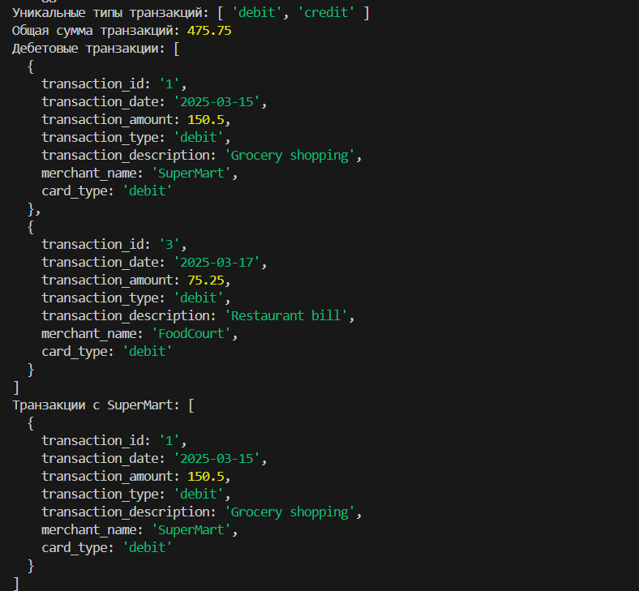
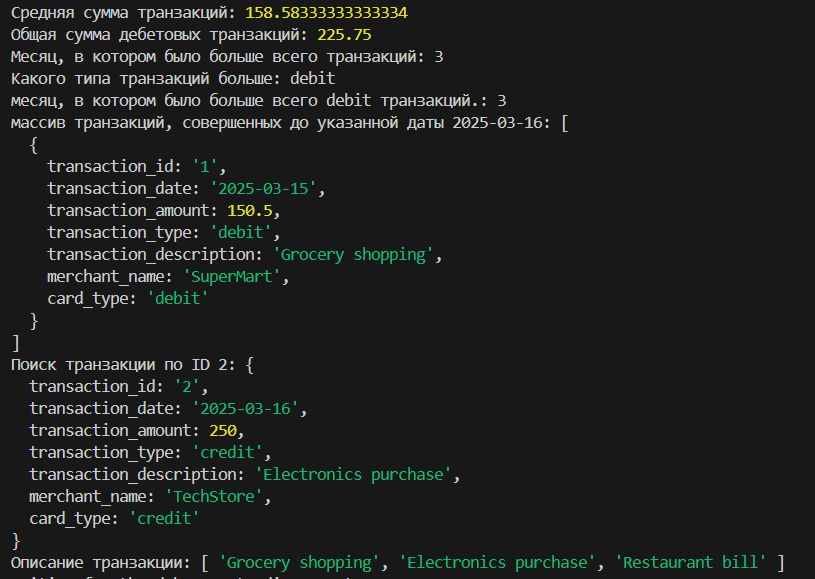
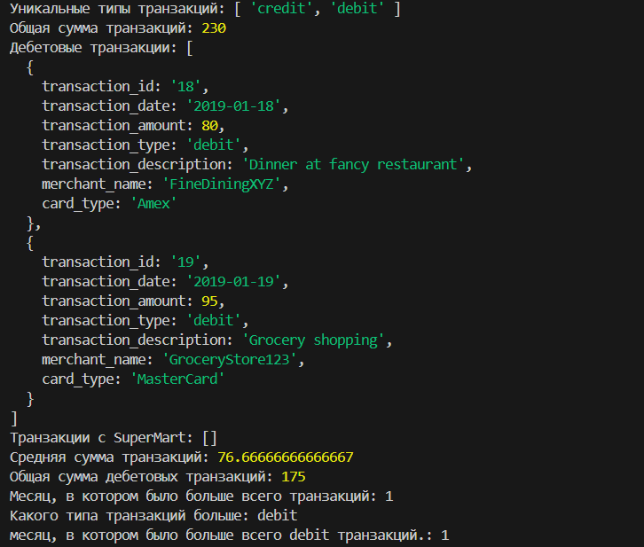
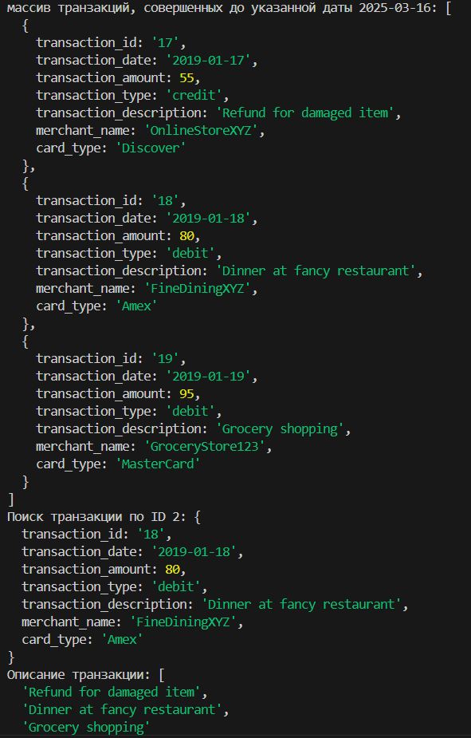
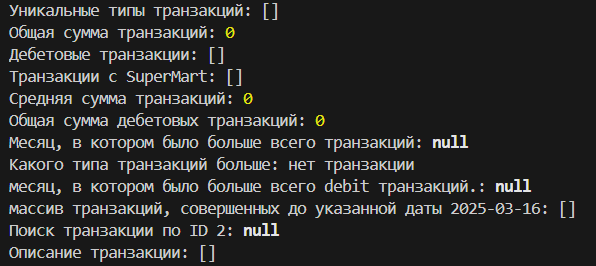
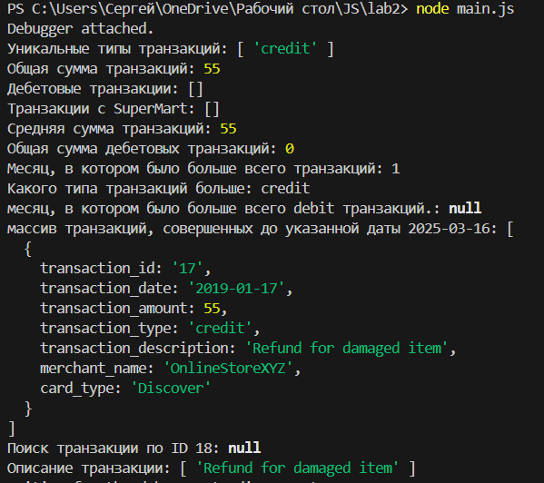

# Лабараторная работа 2

## Описание
Этот проект представляет собой JavaScript-приложение для анализа транзакций. В коде реализован массив транзакций и набор функций для их обработки, включая фильтрацию, агрегацию и вычисления статистики.

## Файлы
- `main.js` - основной файл с реализацией функциональности.

## Структура транзакции
Каждая транзакция представлена объектом со следующими полями:
- `transaction_id` (string) - уникальный идентификатор транзакции
- `transaction_date` (string) - дата транзакции в формате YYYY-MM-DD
- `transaction_amount` (number) - сумма транзакции
- `transaction_type` (string) - тип транзакции (`debit` или `credit`)
- `transaction_description` (string) - описание транзакции
- `merchant_name` (string) - название продавца
- `card_type` (string) - тип карты (`credit` или `debit`)

## Функции
- `getUniqueTransactionTypes(transactions)` - возвращает уникальные типы транзакций
```javascript
function getUniqueTransactionTypes(transactions) {
    return [...new Set(transactions.map(t => t.transaction_type))];
}
```
- `calculateTotalAmount(transactions)` - вычисляет общую сумму всех транзакций
```javascript
function calculateTotalAmount(transactions) {
    return transactions.reduce((sum, t) => sum + t.transaction_amount, 0);
}
```
- `calculateTotalAmountByDate(transactions, year, month, day)` - вычисляет сумму транзакций за указанную дату
```javascript
function calculateTotalAmountByDate(transactions, year, month, day) {
    return transactions.filter(t => {
        const date = new Date(t.transaction_date);
        return (!year || date.getFullYear() === year) &&
               (!month || date.getMonth() + 1 === month) &&
               (!day || date.getDate() === day);
    }).reduce((sum, t) => sum + t.transaction_amount, 0);
}
```
- `getTransactionByType(transactions, type)` - возвращает транзакции определенного типа (`debit` или `credit`)
```javascript
function getTransactionByType(transactions, type) {
    return transactions.filter(t => t.transaction_type === type);
}
```
- `getTransactionsInDateRange(transactions, startDate, endDate)` - находит транзакции в заданном диапазоне дат
```javascript
function getTransactionsInDateRange(transactions, startDate, endDate) {
    return transactions.filter(t => {
        const date = new Date(t.transaction_date);
        return date >= new Date(startDate) && date <= new Date(endDate);
    });
}
```
- `getTransactionsByMerchant(transactions, merchantName)` - фильтрует транзакции по названию продавца
```javascript
function getTransactionsByMerchant(transactions, merchantName) {
    return transactions.filter(t => t.merchant_name === merchantName);
}
```
- `calculateAverageTransactionAmount(transactions)` - вычисляет среднюю сумму транзакции
```javascript
function calculateAverageTransactionAmount(transactions) {
    if (transactions.length === 0) return 0;
    return calculateTotalAmount(transactions) / transactions.length;
}
```
- `getTransactionsByAmountRange(transactions, minAmount, maxAmount)` - фильтрует транзакции по диапазону сумм
```javascript
function getTransactionsByAmountRange(transactions, minAmount, maxAmount) {
    return transactions.filter(t => t.transaction_amount >= minAmount && t.transaction_amount <= maxAmount);
}
```
- `calculateTotalDebitAmount(transactions)` - вычисляет общую сумму дебетовых транзакций
```javascript
function calculateTotalDebitAmount(transactions) {
    return transactions.filter(t => t.transaction_type === "debit")
        .reduce((sum, t) => sum + t.transaction_amount, 0);
}
```
- `findMostTransactionsMonth(transactions)` - находит месяц с наибольшим количеством транзакций
```javascript
function findMostTransactionsMonth(transactions) {
   if (transactions.length === 0) return null;
   const counts = transactions.reduce((acc, t) => {
       const month = new Date(t.transaction_date).getMonth() + 1;
       acc[month] = (acc[month] || 0) + 1;
       return acc;
   }, {});
   return Object.keys(counts).reduce((a, b) => counts[a] > counts[b] ? a : b);
}
```
- `findMostDebitTransactionMonth(transactions)` - находит месяц с наибольшим количеством дебетовых транзакций
```javascript
function findMostDebitTransactionMonth(transactions) {
    if (transactions.length === 0) return null;
    const counts = transactions.filter(t => t.transaction_type === "debit")
        .reduce((acc, t) => {
            const month = new Date(t.transaction_date).getMonth() + 1;
            acc[month] = (acc[month] || 0) + 1;
            return acc;
        }, {});
    return Object.keys(counts).reduce((a, b) => counts[a] > counts[b] ? a : b, null);
}
```
- `mostTransactionTypes(transactions)` - определяет, каких транзакций больше (`debit`, `credit` или одинаковое количество)
```javascript
function mostTransactionTypes(transactions) {
    if (transactions.length === 0) return "нет транзакции";
    const debitCount = transactions.filter(t => t.transaction_type === "debit").length;
    const creditCount = transactions.filter(t => t.transaction_type === "credit").length;
    if (debitCount > creditCount) return "debit";
    if (creditCount > debitCount) return "credit";
    return "equal";
}
```
- `getTransactionsBeforeDate(transactions, date)` - возвращает транзакции до указанной даты
```javascript
function getTransactionsBeforeDate(transactions, date) {
    return transactions.filter(t => new Date(t.transaction_date) < new Date(date));
}
```
- `findTransactionById(transactions, id)` - ищет транзакцию по ID
```javascript
function findTransactionById(transactions, id) {
    return transactions.find(t => t.transaction_id === id) || null;
}
```
- `mapTransactionDescriptions(transactions)` - возвращает массив описаний транзакций
```javascript
function mapTransactionDescriptions(transactions) {
    return transactions.map(t => t.transaction_description);
}
```

## Использование
Пример вызова функций в консоли:
```javascript
console.log("Уникальные типы транзакций:", getUniqueTransactionTypes(transactions));
console.log("Общая сумма транзакций:", calculateTotalAmount(transactions));
console.log("Дебетовые транзакции:", getTransactionByType(transactions, "debit"));
console.log("Транзакции с SuperMart:", getTransactionsByMerchant(transactions, "SuperMart"));
console.log("Средняя сумма транзакций:", calculateAverageTransactionAmount(transactions));
console.log("Общая сумма дебетовых транзакций:", calculateTotalDebitAmount(transactions));
console.log("Месяц, в котором было больше всего транзакций:", findMostTransactionsMonth(transactions));
console.log("Какого типа транзакций больше:", mostTransactionTypes(transactions));
console.log("месяц, в котором было больше всего debit транзакций.:", findMostDebitTransactionMonth(transactions));
console.log("массив транзакций, совершенных до указанной даты 2025-03-16:", getTransactionsBeforeDate(transactions, "2025-03-16"));
console.log("Поиск транзакции по ID 2:", findTransactionById(transactions, "2"));
console.log("Описание транзакции:", mapTransactionDescriptions(transactions));
```

## Тесты

Первый массив транзакции
```javascript
const transactions = [
    {
        transaction_id: "1",
        transaction_date: "2025-03-15",
        transaction_amount: 150.5,
        transaction_type: "debit",
        transaction_description: "Grocery shopping",
        merchant_name: "SuperMart",
        card_type: "debit"
    },
    {
        transaction_id: "2",
        transaction_date: "2025-03-16",
        transaction_amount: 250.0,
        transaction_type: "credit",
        transaction_description: "Electronics purchase",
        merchant_name: "TechStore",
        card_type: "credit"
    },
    {
        transaction_id: "3",
        transaction_date: "2025-03-17",
        transaction_amount: 75.25,
        transaction_type: "debit",
        transaction_description: "Restaurant bill",
        merchant_name: "FoodCourt",
        card_type: "debit"
    }
];
```
Результат:



Новый массив транзакции:




Пустой массив транзакции:



Одна транзакция:



## Котрольные вопросы

## Методы массивов для обработки объектов

При работе с массивами объектов в JavaScript можно использовать следующие методы:

1. **`map()`** – создаёт новый массив, применяя функцию к каждому элементу.
2. **`filter()`** – возвращает новый массив, содержащий только элементы, удовлетворяющие заданному условию.
3. **`reduce()`** – сворачивает массив в одно значение (например, сумму, объект и т. д.).
4. **`forEach()`** – выполняет итерацию по массиву, но не возвращает новый массив.
5. **`find()`** – находит первый элемент, удовлетворяющий условию.
6. **`some()`** – проверяет, есть ли хотя бы один элемент, соответствующий условию.
7. **`every()`** – проверяет, соответствуют ли все элементы условию.
8. **`sort()`** – сортирует массив по заданному критерию.
9. **`includes()`** – проверяет, содержит ли массив определенное значение.

---

## Как сравнивать даты в строковом формате в JavaScript

Если даты даны в строковом формате (например, `"2024-03-30"`), их можно преобразовать в объект `Date`:

```javascript
const date1 = new Date("2024-03-30");
const date2 = new Date("2024-03-29");

console.log(date1 > date2);  // true
console.log(date1 < date2);  // false
console.log(date1.getTime() === date2.getTime()); // false
```
---

## Разница между `map()`, `filter()` и `reduce()`

В JavaScript существуют три мощных метода работы с массивами: map(), filter() и reduce(). Несмотря на то, что все они обрабатывают массивы, каждый из них выполняет свою конкретную задачу.

Метод map() используется для преобразования элементов массива. Он проходит по каждому элементу, применяет к нему функцию и возвращает новый массив с результатами этих преобразований. Например, если мы хотим удвоить все числа в массиве, map() сделает это, не изменяя оригинальный массив.

Метод filter() нужен, когда требуется отфильтровать элементы массива по определённому условию. Он также возвращает новый массив, но включает в него только те элементы, для которых переданная функция вернёт true. Это удобно, например, когда нужно получить только чётные числа из массива.

Метод reduce() работает по-другому: он сворачивает массив в одно итоговое значение. Он принимает функцию, которая накапливает результат, проходя по массиву шаг за шагом. С его помощью можно, например, посчитать сумму всех чисел в массиве или собрать объект на основе данных массива. В отличие от map() и filter(), reduce() может вернуть значение любого типа — не только массив.

Таким образом, map() трансформирует элементы, filter() отбирает нужные, а reduce() агрегирует всё в одно значение. Все три метода не изменяют оригинальный массив и позволяют писать чистый, читаемый код в функциональном стиле.

Каждый метод выполняет свою задачу:
- `map()` изменяет данные,
- `filter()` отбирает нужные элементы,
- `reduce()` сворачивает массив в одно значение.


